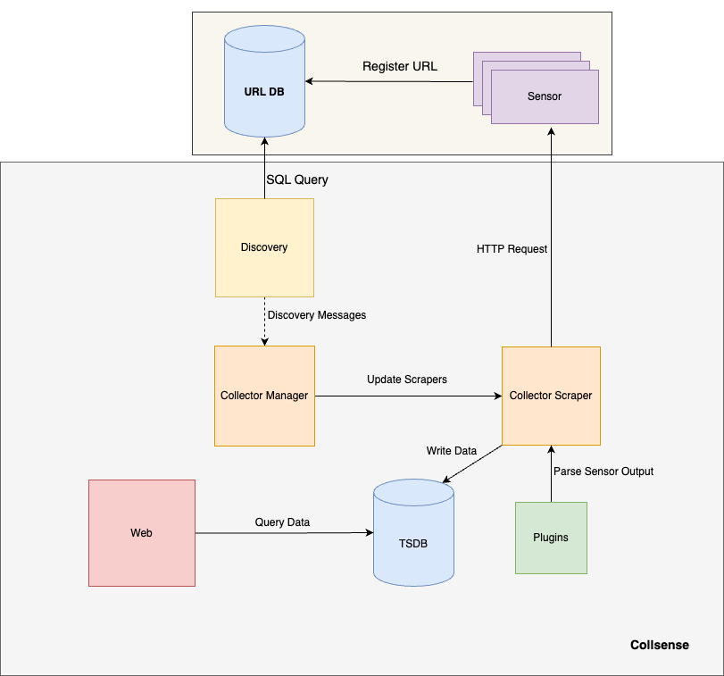

# Architecture
Collsesne has several components that work together to accomplish various 
responsibility. Architecture can be seen in below diagram:

  

Next section will explain each of the components in the diagram.

## Sensor
Sensor is a simple http server that returns any parameter that senses from the 
world as json output. It also registers its url in the database for scraping by
Collsense application.

## URL Database
It is a relational database that stores the url of sensors. Collsense can be 
aware of sensors by this database.

## Discovery
This component query URL Database periodically to discover changes in the url 
of sensors. After discovering changes, it informs the Collector Manager via 
message queue as a producer. In this part of the application, producer-consumer
pattern is used.

## Collector Manager
This component gets the url of sensors from the Discovery component via message
queue as a consumer. According to the message it receives, it creates, deletes 
or updates the collector scrapers. This component creates collector scrapers 
for each url and maintains a map between url and scraper to manage the life 
cycle of collector scrapers.

## Collector Scraper
Scraper makes requests to the sensor in specified intervals and stores data in 
TSDB. Json output of scraper can be varied by structure and name of the 
parameters, so to parse different types of sensor output, plugins can be added 
to the application by users.

## Plugins
Plugins define json schema of each sensor and implement a function to parse 
output of sensors to specified measurements that can be stored in TSDB.

## TSDB
Scrapers collect data from sensors along the time, so applications need a 
time series database to store these data appropriately.  Collsense uses 
influxdb as TSDB.

## Web
Collsense processes data and needs to show its results to the users, 
for example calculate mean of data in specific window time. Web component
provide web applications to show reports to the users.